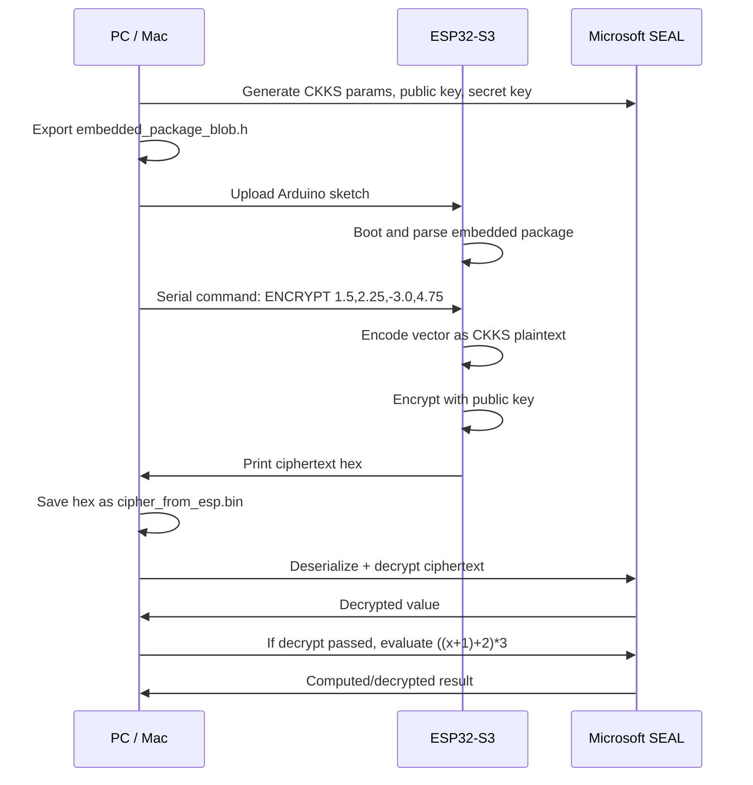

# Hardware Test Flow

This document explains the current end-to-end flow in simple terms.

## Big Picture

The PC is the trusted/heavy machine. The ESP32 is the small encryption box.


## What Is Complete Right Now

- PC-side key/parameter generation works through Microsoft SEAL.
- PC-side export of a compact ESP32 package works.
- ESP32-side package loading works.
- ESP32-side real-vector CKKS encryption works for the current single-prime `N=4096` test setup.
- ESP32-side ciphertext serialization is SEAL-compatible.
- Serial capture from ESP32 to PC works.
- PC-side SEAL can decrypt the ESP32 ciphertext.
- PC-side test can also do a small computation after decrypt verification:

```text
((x + 1) + 2) * 3
```

## What Is Not Final Yet

- This is still a prototype, not production crypto.
- Multi-prime RNS chains are not implemented on the ESP32 yet.
- Only the current single-prime parameter path is implemented.
- Full CKKS vector packing is not implemented on the ESP32 yet.
- Multi-prime RNS chains are not implemented on the ESP32 yet.
- Runtime PSRAM behavior still needs more checking; one successful board run showed encryption working, but PSRAM counters should be watched carefully.

## Folder Roles

```text
pc_tools/
```

Runs on the Mac/PC. It generates keys, exports packages, decrypts, verifies, and performs PC-side tests.

```text
arduino/MiniEncryptDemo/
```

Repo copy of the Arduino sketch.

```text
/Users/burhanahmadkhan/Documents/Arduino/MiniEncryptDemo/
```

Arduino sketchbook copy. This is the folder Arduino IDE/CLI can compile and upload directly.

```text
esp32_client/src/
```

Reusable embedded C++ source files used by the sketch.

```text
docs/
```

Architecture notes, progress notes, format notes, and this hardware flow guide.

## Actual Runtime Flow



## Commands

Compile:

```bash
arduino-cli compile \
  --fqbn esp32:esp32:esp32s3:PSRAM=opi,PartitionScheme=huge_app,FlashSize=4M,UploadSpeed=115200 \
  /Users/burhanahmadkhan/Documents/Arduino/MiniEncryptDemo
```

Upload:

```bash
arduino-cli upload \
  -p /dev/tty.usbserial-10 \
  --fqbn esp32:esp32:esp32s3:PSRAM=opi,PartitionScheme=huge_app,FlashSize=4M,UploadSpeed=115200 \
  /Users/burhanahmadkhan/Documents/Arduino/MiniEncryptDemo
```

Capture, save, decrypt-check, and compute-check:

```bash
pc_tools/serial/capture_esp_ciphertext.py \
  --port /dev/tty.usbserial-10 \
  --values 1.5,2.25,-3.0,4.75 \
  --out pc_tools/test_vectors/cipher_from_esp.bin \
  --report pc_tools/test_vectors/encrypt_report.txt \
  --bundle pc_tools/test_vectors/bundle_4096.bin \
  --secret pc_tools/test_vectors/secret_4096.bin \
  --verify
```

Manual monitor:

```bash
arduino-cli monitor -p /dev/tty.usbserial-10 -c baudrate=115200
```

Benchmark/memory report:

```bash
pc_tools/serial/capture_esp_ciphertext.py \
  --port /dev/tty.usbserial-10 \
  --value 1.5 \
  --bench-runs 10 \
  --report pc_tools/test_vectors/bench_report.txt
```

## What To Watch In Serial Output

Good signs:

```text
MiniEncryptDemo serial mode
READY
CIPHERTEXT_BYTES=65649
BEGIN_CIPHERTEXT_HEX
...
END_CIPHERTEXT_HEX
check=PASS
compute_check=PASS
```

Memory lines to watch:

```text
boot_heap_free=...
boot_psram_found=...
boot_psram_free=...
before_encrypt_heap_free=...
after_encrypt_heap_free=...
TRACKED_BYTES_PEAK_DELTA=...
TRACKED_PSRAM_PEAK_DELTA=...
```

If `psram_found=0`, the sketch can still pass the small current test, but the board is using the wrong PSRAM mode. This ESP32-S3 CAM tested correctly with `PSRAM=opi`, which reported about 8 MB of PSRAM.

## Why The Ciphertext Gets Back To The PC

The ESP32 does not write directly to a file. It prints the ciphertext over USB serial as text. The PC capture script listens to that serial text, grabs only the ciphertext hex section, converts it back into bytes, and writes:

```text
pc_tools/test_vectors/cipher_from_esp.bin
```

That `.bin` file is then passed into normal Microsoft SEAL on the PC.

## Current Measured Prototype Numbers

These are from the ESP32-S3 CAM test using `N = 4096`, `scale_bits = 20`, and `PSRAM=opi`.

```text
N=4096
SCALE_BITS=20
COEFF_MODULUS=1125899906826241
PACKAGE_BYTES=65616
C0_BYTES=32768
C1_BYTES=32768
PERSISTENT_TABLE_BYTES=212992
CIPHERTEXT_SERIALIZED_BYTES=65649
ENCRYPT_MS_AVG=1196
SERIALIZE_MS_AVG=3
TOTAL_MS_AVG=1199
TRACKED_PEAK_DELTA_MAX=262257
TRACKED_PSRAM_PEAK_DELTA_MAX=262257
TRACKED_INTERNAL_PEAK_DELTA_MAX=0
PSRAM_FREE_BEFORE=8164396
PSRAM_FREE_MIN_SEEN=8029216
PSRAM_FREE_AFTER=8164396
```

Plain-English meaning:

- The always-loaded encoder/NTT tables use about `213 KB`.
- A single vector encryption temporarily needs about `262 KB` more tracked HE buffer memory.
- That temporary HE memory is going into PSRAM, not internal RAM.
- Internal heap stayed stable during the measured encryption command.
- Encryption currently takes about `1.2 seconds` for the `N=4096` vector prototype.

## Measurement Caveats

The software can measure time, heap, PSRAM, and tracked HE allocations. It cannot accurately measure electrical energy without external hardware. Energy measurement is intentionally deferred for now.
